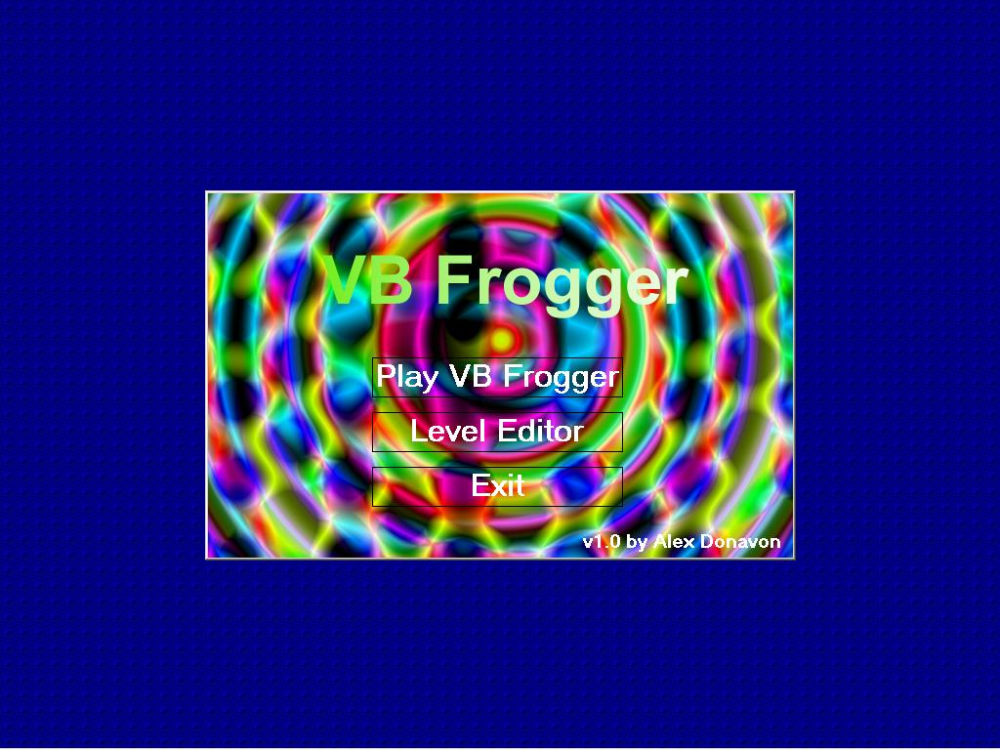



## VB Frogger v1\.0

### Description

This is a full clone of the classic Frogger, now with nice graphics, a

level editor, sounds, and more! Take a break from your day and enjoy this

nice game! (O:
 
### More Info
 

             |
---                |---
**Submitted On**   |2001-08-14 19:54:36
**By**             |[SeeD](https://github.com/Planet-Source-Code/PSCIndex/blob/master/ByAuthor/seed.md)
**Level**          |Intermediate
**User Rating**    |4.0 (16 globes from 4 users)
**Compatibility**  |VB 4\.0 \(32\-bit\), VB 5\.0, VB 6\.0
**Category**       |[Games](https://github.com/Planet-Source-Code/PSCIndex/blob/master/ByCategory/games__1-38.md)
**World**          |[Visual Basic](https://github.com/Planet-Source-Code/PSCIndex/blob/master/ByWorld/visual-basic.md)
**Archive File**   |[VB Frogger250108202001\.zip](https://github.com/Planet-Source-Code/seed-vb-frogger-v1-0__1-26421/archive/master.zip)

